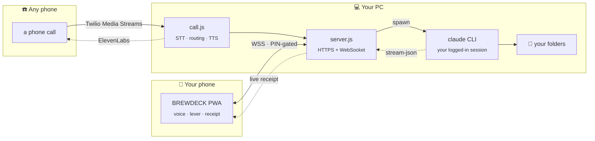

<div align="center">

# ☕ BREWDECK

### *Your PC is the espresso bar. Claude Code is the barista. Your phone is the counter.*


<br/>

[](https://nodejs.org)
[](https://docs.claude.com/en/docs/claude-code)
[](#-requirements)
[](#-quick-start)

<br/>

**Talk to Claude Code from your phone — or from a phone call.**
No API key. No cloud relay. No account to create.
It drives the `claude` CLI already logged in on *your* machine.

<br/>

```
     ╔═══════════════════════════════════════════════╗
     ║   ☕  P U L L   T H E   L E V E R              ║
     ║                                               ║
     ║   ▓▓▓▓▓▓▓▓▓▓▓▓▓░░░░░░░  extracting…           ║
     ║   › writing src/pause-menu.tsx                ║
     ║   › running npm run build                      ║
     ║   ✓ served in 41s · $0.03                      ║
     ╚═══════════════════════════════════════════════╝
```

</div>

---

## 🎯 Why this exists

Claude Code is extraordinary, and it's stuck on your desk.

BREWDECK unsticks it. Your PC keeps doing the work — full filesystem, real terminal, your logged-in session — while **your phone becomes the remote**. Start a refactor from the couch. Check the build from the bus. Ask your laptop what's on its screen while you're in another room.

> **The brew runs on the PC, never on the phone.** Lock the screen, close the app, lose signal, switch from Wi-Fi to cellular — it keeps going. Reopen whenever and the entire receipt replays.

<br/>

## ✨ What you get

<table>
<tr>
<td width="50%" valign="top">

### 🎙️ Voice-first, not voice-bolted-on
Hold the lever, speak, release. That's a brew. Keyboard and 📷 photo upload are there when you'd rather type or show.

</td>
<td width="50%" valign="top">

### ☎️ Reachable by actual phone call
Ring a number and *talk* to Claude Code. Works from a smartwatch, a dumbphone, a car — anything that can dial. Hands never leave the wheel.

</td>
</tr>
<tr>
<td width="50%" valign="top">

### 🫘 Models are characters, not dropdowns
Every bean is a bar spirit with its own rig, sound motif and haptics. Switching plays a full transition — collapse, whiteout, resolve.

</td>
<td width="50%" valign="top">

### ⚙️ Grind dial = reasoning effort
Twist from coarse chunks to ☠ powder. Finer grind, harder extraction — exactly like tuning a real shot. Five detents, each a transformation.

</td>
</tr>
<tr>
<td width="50%" valign="top">

### 🧾 THE TAB
Today's spend, 7-day bars, 14-day breakdown by bean — parsed straight from your local Claude Code logs.

</td>
<td width="50%" valign="top">

### 🔔 Push when it's served
The **PC** fires the notification, so "☕ order served" reaches your pocket with the app fully closed.

</td>
</tr>
</table>

<div align="center">

### The roster

| Bean | Model | Spirit | Roast |
|:---:|:---:|:---:|:---:|
| 🌫️ | **Haiku** | **WISP** — steam sprite | Light Roast |
| ☕ | **Sonnet** | **CREMA** — house barista | House Blend |
| 🗿 | **Opus** | **BURR** — grinder golem | Dark Roast |
| 🖊️ | **Fable** | **QUILL** — ink crane | Reserve Ristretto |

### The grind

`SINGLE` → `DOPPIO` → `TRIPLE` → `QUAD` → `☠️ DEATH WISH`

*maps to `--effort low … max` · tier-up = shockwave + palette snap + screen-shake*

</div>

<br/>

## 🚀 Quick start

> **2 minutes.** Nothing to configure, no keys to paste. Every credential is generated locally on first boot.

### 1️⃣ Install the two things it drives

| | |
|---|---|
| **[Node.js](https://nodejs.org)** 20.12+ | runs the bar |
| **[Claude Code](https://docs.claude.com/en/docs/claude-code)** | *is* the barista — install it and run `claude` once to log in |

```bash
npm install -g @anthropic-ai/claude-code
claude          # log in, then exit. BREWDECK reuses this session.
```

### 2️⃣ Clone and start

```bash
git clone https://github.com/SIDDHANTH-THAKURI/BrewDeck.git
cd BrewDeck
npm start       # or just double-click start.cmd on Windows
```

First run installs dependencies and generates your **PIN**, auth secret, push keys and a TLS certificate. The terminal prints:

```
  ☕ BREWDECK is open

  PIN: 48217309
  Wi-Fi:  https://192.168.1.42:8443     ← open this on your phone
  ▄▄▄▄▄▄▄▄▄▄▄▄▄  ← or scan the QR
```

### 3️⃣ Open it on your phone

1. Same Wi-Fi as the PC
2. Scan the QR (or type the URL)
3. Accept the certificate warning **once** — *Advanced → Proceed*
   <sub>It's self-signed, and HTTPS is non-negotiable for microphone access.</sub>
4. Enter the 8-digit PIN
5. *Optional:* **Add to Home Screen** for a real app feel
6. **Hold the lever and order something.**

<div align="center">

**That's it. You're brewing.** ☕

</div>

<br/>

## 🌍 Use it from anywhere (not just home Wi-Fi)

BREWDECK **never opens a port to the public internet.** Even an 8-digit PIN standing between the whole internet and code execution on your PC is a bad trade. Instead it rides [**Tailscale**](https://tailscale.com), a private encrypted mesh — your devices get addresses that only reach each other.

<details>
<summary><b>Set it up (5 minutes, one time)</b></summary>

<br/>

1. Install Tailscale on the **PC** → <https://tailscale.com/download> → sign in (`tailscale up`)
2. Install the Tailscale app on your **phone** → sign in with the **same account**
3. Restart BREWDECK — it now prints an extra line:
   ```
   Anywhere (Tailscale): https://100.x.x.x:8443
   ```
4. That URL works from mobile data, a café, another country. Same PIN, same app.

**For push notifications too** (browsers refuse service workers on self-signed certs):

5. Enable HTTPS certs for your tailnet → <https://login.tailscale.com/admin/dns> → *Enable HTTPS*
6. Restart. Open the app from the new **`Trusted:`** URL — real Let's Encrypt cert, no warning.
7. Tap 🔔 → allow notifications.

Your phone just needs Tailscale *running* in the background — no need to open it.

<br/>

**No-Tailscale fallback for push:** install [ntfy](https://ntfy.sh), pick a long random topic, subscribe, then add `"ntfyTopic": "your-topic"` to `brewdeck.config.json`.

</details>

<br/>

## ☎️ Talk to Claude Code over a phone call

<div align="center">

*The party trick.* Dial a number, speak, and Claude Code works on your PC.
Built so a smartwatch could reach it with the phone still in a pocket.

</div>

Unlike the browser mode, this one **needs three API keys** (all have free tiers). It's a genuine phone call: Twilio carries the audio, Deepgram transcribes, Claude Code does the work, ElevenLabs speaks back.

<details>
<summary><b>Full call setup</b></summary>

<br/>

**1. Get the keys**

| Service | What it does | Where |
|---|---|---|
| **Twilio** | phone number + audio streaming | [twilio.com](https://twilio.com) → buy a voice-capable number |
| **Deepgram** | speech → text (streaming) | [deepgram.com](https://deepgram.com) |
| **ElevenLabs** | text → speech (streaming) | [elevenlabs.io](https://elevenlabs.io) → copy a voice ID |

**2. Create `.env`** in the project root (it's gitignored — keys never leave your machine):

```ini
TWILIO_ACCOUNT_SID=ACxxxxxxxxxxxxxxxxxxxxxxxxxxxxxxxx
TWILIO_AUTH_TOKEN=your_twilio_auth_token
DEEPGRAM_API_KEY=your_deepgram_key
ELEVENLABS_API_KEY=your_elevenlabs_key
ELEVENLABS_VOICE_ID=your_chosen_voice_id

# ONLY these numbers may call. Comma-separated. This is the front door — set it.
CALL_ALLOW_FROM=+61412345678

# Your public hostname (Tailscale Funnel or similar) — Twilio must reach it
CALL_PUBLIC_HOST=your-machine.your-tailnet.ts.net
```

<sub>Optional: `CALL_GREETING`, `CALL_MODEL`, `CALL_EFFORT`, `CALL_BUDGET_USD` (default `1`).</sub>

**3. Expose the webhook** — Twilio needs a public HTTPS URL. With Tailscale:

```bash
tailscale funnel --bg "https+insecure://localhost:8443"
```

<sub>⚠️ The `https+insecure://` prefix matters — BREWDECK serves HTTPS, and plain `--bg 8443` assumes an HTTP backend and returns 502.</sub>

**4. Point your Twilio number at it** — in the Twilio console, set the number's
*A Call Comes In* webhook to:

```
https://<your-public-host>/twilio/voice     (HTTP POST)
```

**5. Call it.** Say *"what can you do"* to start.

<br/>

### On the call

| Say this | What happens |
|---|---|
| *"open my downloads folder"* | runs it on your PC |
| *"can you see my screen?"* | takes a screenshot and tells you |
| *"switch to opus"* / *"use high effort"* | changes model / reasoning mid-call |
| *"keep working in the background"* | task outlives the turn, reports back |
| *"bye"* / *"hang up"* | ends the call |

**Two tiers, routed automatically.** Ordinary conversation goes to a fast model with no tools, outside your repo. Real work goes to Sonnet with full tool access. You never pick — it reads the request shape.

**A soft two-note tone** plays while it's thinking, so you can tell "still working" from "call dropped" without interrupting.

<br/>

### Guardrails on the call path

Calls are the least-verifiable surface, so they're the most restricted:

- ✅ **Caller allowlist + Twilio request-signature validation** — caller ID alone is spoofable, so the signature is the real gate
- 🚫 `git push`, `gh` publish/merge/release and `npm publish` are **hard-blocked** by a `PreToolUse` hook, even under bypassed permissions
- 🔒 `--strict-mcp-config` keeps your account's other MCP servers (Gmail, Drive, Calendar) unreachable from a call
- 🧹 Browser control uses a **throwaway profile** — a call can't act as the signed-in you
- 🙅 The prompt forbids typing credentials, buying anything, or sending/posting on your behalf

</details>

<br/>

## 🏗️ How it works



Every brew is just a subprocess on your machine:

```bash
claude -p --output-format stream-json --include-partial-messages \
  --model <bean> --effort <grind> --permission-mode bypassPermissions \
  --max-budget-usd <cap> [--resume <same-cup-session>]
```

…with the working directory set to whatever folder the 📁 chip shows.

<br/>

## 🔐 Security

> **Read this once.** BREWDECK executes code on your computer. That's the whole point, and it deserves your attention.

| | |
|---|---|
| 🏠 **Never publicly exposed** | Home Wi-Fi or Tailscale's encrypted mesh only. The auth token never leaves either. |
| 🔢 **PIN brute-force lockout** | 5 wrong tries locks that source 15s, doubling to ~8 min on repeated abuse. |
| ⚠️ **Permissions are bypassed** | So the barista never stalls on an approval you can't see. **Claude can freely edit files and run commands inside the folder you pick.** Point it only at folders you're happy to let it work in. |
| 🙈 **Nothing secret is committed** | PIN, keys, certs and brew history live in gitignored files. Each clone generates its own. |
| 🔥 **Firewall** | If Windows asks about Node.js, allow it on **Private** networks — otherwise your phone can't reach the bar. |

<br/>

## 🧰 Requirements

| | |
|---|---|
| **OS** | Windows is the primary target (screen capture and native input use PowerShell). The core server and browser UI are cross-platform. |
| **Node.js** | 20.12 or newer <sub>(`--env-file-if-exists` landed there)</sub> |
| **Claude Code** | installed and logged in — BREWDECK spawns it, it does **not** use an API key |
| **Phone** | Chrome on Android for best voice. iPhone works, but use the keyboard — Safari's speech support is patchy. |

<sub>🗣️ The language chip flips voice recognition between **English** and **हिन्दी**.</sub>

<br/>

## 📂 Project layout

```
brewdeck/
├── server.js              HTTPS + WebSocket server, job runner, brew store, push, usage ledger
├── call.js                the phone-call path — STT, intent routing, TTS, memory
├── call-hooks/
│   ├── block-push.mjs     PreToolUse hook: hard-blocks git push / publish on calls
│   ├── screenshot.ps1     full virtual-screen capture
│   └── input.ps1          native mouse + keyboard + window focus
├── public/
│   ├── app.js             the phone UI
│   ├── fx.js              character rigs, particles, transitions, WebAudio synth, haptics
│   ├── fx-lab.html        FX test bench — every character, tier and transition, with sliders
│   └── sw.js              service worker: push + offline shell
├── scripts/
│   ├── test-call.mjs      call-path unit tests
│   ├── test-lifecycle.mjs boots an isolated bar with a fake claude, kills clients mid-brew
│   └── test.mjs           live E2E against the real bar + real Claude (costs a few cents)
├── .brews/                persisted receipts (last 25) + push subscriptions  [gitignored]
└── brewdeck.config.json   PIN / port / default folder / push keys           [gitignored]
```

```bash
npm test            # unit + lifecycle tests, no cost
npm run test:live   # full E2E against real Claude (server must be running)
```

<br/>

## 🩺 Troubleshooting

<details>
<summary><b>Phone can't reach the bar</b></summary>

<br/>

- Same Wi-Fi as the PC? (Guest networks usually isolate devices.)
- Windows Firewall → allow Node.js on **Private** networks.
- Try the Tailscale URL instead — it sidesteps local network quirks entirely.

</details>

<details>
<summary><b>Certificate warning won't go away</b></summary>

<br/>

Expected on the `192.168.x.x` URL — the cert is self-signed. Tap *Advanced → Proceed* once. To lose it permanently, enable [Tailscale HTTPS](https://login.tailscale.com/admin/dns) and use the `Trusted:` URL.

</details>

<details>
<summary><b>Microphone doesn't work</b></summary>

<br/>

Browsers only allow mic access over HTTPS — make sure you opened the `https://` URL and accepted the cert. On iPhone, use the keyboard instead.

</details>

<details>
<summary><b>Push notifications never arrive</b></summary>

<br/>

Service workers are refused on self-signed certs. You need the **`Trusted:`** Tailscale URL (real Let's Encrypt cert), then tap 🔔 and allow. Or use the [ntfy](https://ntfy.sh) fallback.

</details>

<details>
<summary><b>Twilio returns 502 on the call webhook</b></summary>

<br/>

Your funnel is proxying to an HTTP backend, but BREWDECK serves HTTPS. Use:

```bash
tailscale funnel --bg "https+insecure://localhost:8443"
```

</details>

<details>
<summary><b>Call connects but there's silence</b></summary>

<br/>

Almost always the ElevenLabs config. Check `ELEVENLABS_VOICE_ID` is a voice that exists on your account — a bad ID closes the socket with `1008` and produces no audio at all. The server logs the close code.

</details>

<br/>

## 🤝 Sharing it with someone

Just hand them the repo. There's **nothing to transfer** — no shared PIN, no shared keys, no shared account. They install Node and Claude Code, log into *their own* Claude account, run `start.cmd`, and their install generates its own credentials.

It runs on their machine, against their session, in their folders. Nothing you set up touches theirs.

<br/>

---

<div align="center">

### ☕ Pull the lever.

<sub>Built with [Claude Code](https://claude.com/claude-code) · the barista helped build the bar.</sub>

</div>
